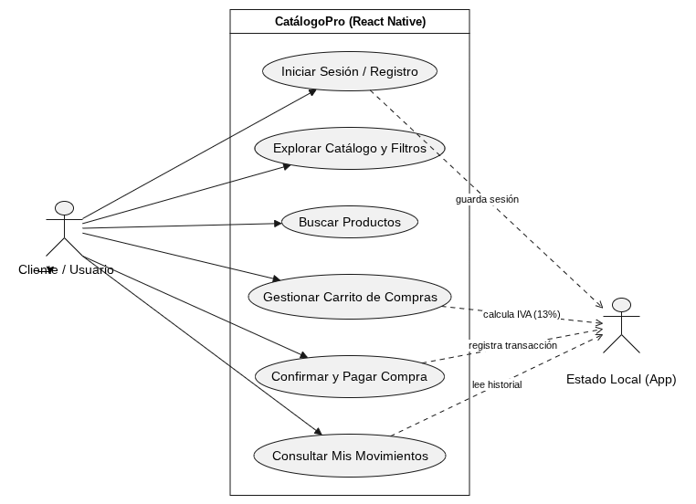

# Diagrama de Casos de Uso - CatálogoPro

## 1. Representación Visual

## 2. Descripción de Actores y Flujos

- **Usuario / Cliente:** Puede registrarse, iniciar sesión, buscar productos, filtrar por categoría (Computadoras, Celulares, Accesorios, Componentes), agregar artículos al carrito, gestionar cantidades, simular la compra y revisar su historial en "Mis Movimientos".
- **Estado de la App (React Native):** Procesa los filtros de búsqueda, mantiene los artículos seleccionados en el carrito, calcula el IVA (13%) y almacena en tiempo real los registros de actividad del usuario.