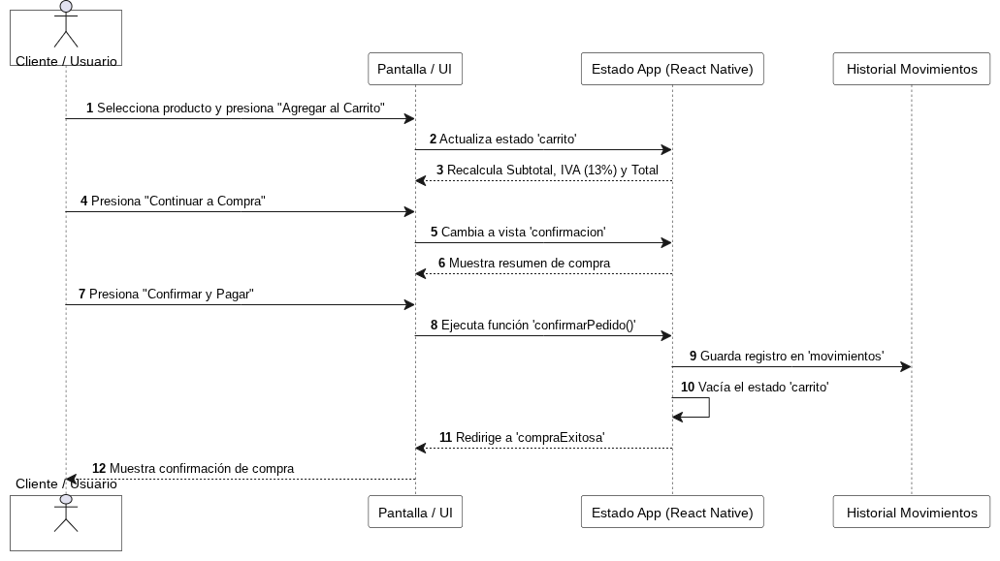

# Diagrama de Secuencia - Flujo de Compra en CatálogoPro

## 1. Diagrama de Interacción

## 2. Explicación del Flujo
1. **Selección de Producto:** El usuario explora el catálogo o la vista de detalle y presiona "Agregar al Carrito".
2. **Cálculo Financiero:** La app actualiza el estado `carrito`, recalculando en tiempo real el Subtotal, IVA (13%) y el Monto Total.
3. **Confirmación de Compra:** El usuario navega a la vista `confirmacion`, verifica sus datos de contacto (nombre y teléfono) y los productos del pedido.
4. **Finalización:** Al presionar "Confirmar y Pagar", se ejecuta la función `confirmarPedido()`, creando un registro en el historial de `movimientos`, vaciando el carrito y redirigiendo a la pantalla `compraExitosa`.